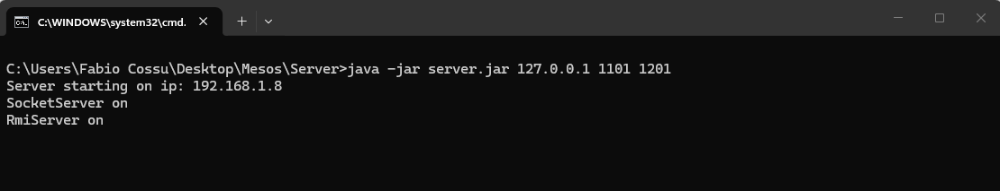
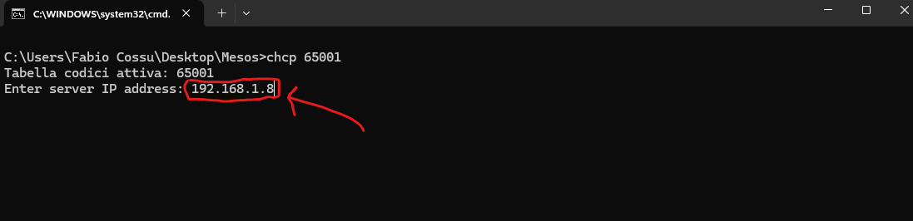

# Prova Finale di Ingegneria del Software
## A.S. 2025/26, Gruppo AM31

Il progetto consiste nello sviluppo di una versione software del gioco da tavolo Mesos.

<mark>***Il Gioco da tavolo Mesos e tutto il relativo materiale grafico è di esclusiva proprietà di Cranio Creations.***</mark>


## Autori

- [@Ambrogio Federico](https://github.com/Fedepoci)
- [@Bertonati Rachele](https://github.com/RacheleBertonati)
- [@Cossu Fabio](https://github.com/CossuFabio)
- [@Davì Simone](https://github.com/I000I0)


## Come Giocare

Clona la repository

```bash
  git clone https://github.com/CossuFabio/IS26-AM31
```

Crea i bat per aprire i jar, per il server (serve una versione di Java 25 per usare i jar inclusi): 

```bash
  java -jar server.jar 127.0.0.1 1101 1201 pause
```

Per il client (questo script forza l'esecuzione in powershell):

```bash
  chcp 65001
  @echo off 
  powershell.exe -NoProfile -ExecutionPolicy Bypass -Command "[Console]::OutputEncoding = [System.Text.Encoding]::UTF8; & 'PERCORSO FINO ALLA TUA JAVA 25\java.exe' '--enable-native-access=ALL-UNNAMED' '-Dfile.encoding=UTF-8' -jar 'client.jar'"
```
Per le funzionalità di database, bisogna avere scaricato una versione di MYSQL  
 dalla 8.0 in poi , e creare il db con lo script incluso nel file ["mesos_db_schema.sql"](mesos_db_schema.sql).  
 Inoltre bisogna mettere nella stessa cartella del bat del server un file denominato "database.properties" così compilato:
```bash
  db.url= jdbc:msyql://localhost:3306/mesos_db
  db.username = root (o qualunque sia il vostro UserName)
  db.password = (la vostra password di mysql)
  db.driver = com.mysql.cj.Driver
```
Per giocare, aprire prima il server, poi i client inseriranno l'indirizzo ip mostrato dal server.  


  



## Funzionalità

- JUnit testing
I componenti del gioco sono stati testati singolarmente con JUnit  
 e la copertura del codice è disponibile [qui](/img/tests.png), il test della classe Game è all'84% (mancano getter e setter).

- Regolamento del gioco disponibile in italiano in [Rules_ITA.pdf](Rules_ITA.pdf)
- Connessione disponibile a scelta con Socket/Rmi
- Visualizzazione disponibile a scelta con CLI/GUI

### Avanzate
- Gestione partite multiple
- Salvataggio risultati e classifica globale su DB
# 
Grafici UML class e sequence diagram disponibili nella cartella [Deliveries](DELIVERIES)
